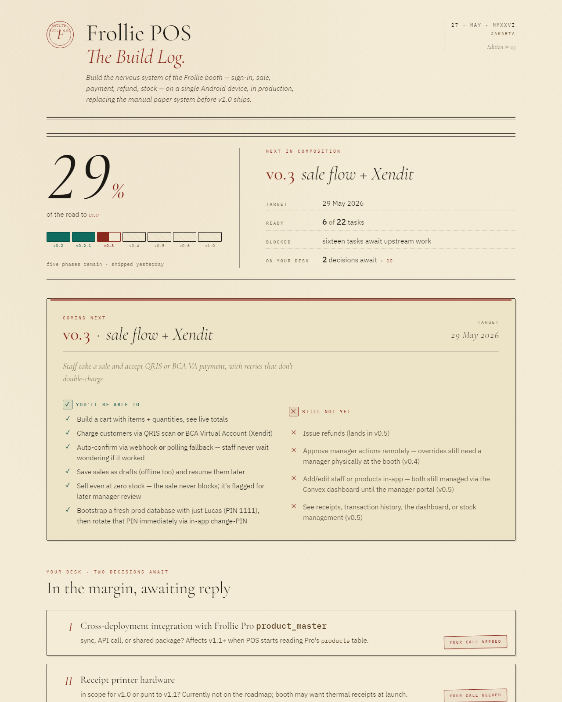

# CEO Progress Report



> Turn `PROGRESS.md` into an editorial build-log dashboard your CEO will actually read.

---

## Why this exists

I'm a solo-agentic engineer building the systems to run my small Indonesian FMCG business, [Frollie](https://frollie.id). The current project is a point-of-sale from scratch — single device, digital payments, three staff on overlapping shifts. Not enormous by enterprise standards, but more than I could hold in my head while juggling Dad duties, customer calls, and the other fires that come with a young company.

The fragmentation crept up on me. I'd open the repo on a Tuesday morning, stare at the codebase for ten minutes, and realise I had no idea which phase I was on, what I'd committed to ship by Friday, or whether the decision I half-thought-out last week had actually been resolved. The AI assistants I'd dispatched to work in parallel weren't helping either — they returned progress on individual tasks, but no one was holding the shape of the whole program.

So I went back to my McKinsey consulting days and asked the question I'd ask of any big client tech program: **what does a CEO need to see?**

Not a Gantt chart. Not a Jira board. Not engineering velocity. A CEO needs to know what's about to ship, what's already shipped, what's blocked on a decision they need to make, and what's quietly been cut from scope. Five questions, answerable in 30 seconds. Anything else is overhead.

This package is the answer I built for myself. The renderer is the wrapping; the discipline — the voice, the format, the refusal conditions — is the part that does the work. Hopefully it's useful for you too.

---

## When you'd use this

This package is for projects too big to hold in your head across sessions.

The shape it's built for:

- **Multiple stacks at once.** A backend with schema migrations, a frontend with state management, integrations with payment processors, identity, comms. The kind of project where one engineer can ship it, but only with help, and only across many sittings.

- **Multi-agent assistance.** You're not coding alone. You're dispatching subagents to take phases or features in parallel, and each one needs the shape of the whole before they touch their slice. The build log is the artifact they pick up to find their footing.

- **Asynchronous shipping.** You don't sit down for a week-long sprint. You ship in pockets — an hour here, an afternoon there, between Dad duties and customer escalations. Without a persistent source of truth, every session begins with re-orientation, and re-orientation is expensive.

- **Decisions you need someone else to make.** There's a list of choices waiting for a stakeholder, a co-founder, a board. The Decisions section keeps them visible. They don't get lost in Slack threads. When the resolution lands, it gets recorded — not deleted — so the institutional memory of *why* compounds with every shipped version.

You'll know it's working when:

- You can open `progress.html` after a 3-day break and resume work without re-reading the codebase.
- A teammate (or an AI agent) you've handed off to can find the open decisions and risks without your help.
- The week's check-in becomes "look at the page" instead of "let me walk you through where we are."

If you're sprint-blasting on a small feature alone with no context switches, you don't need this. You need it the moment the project gets larger than a single session of focus.

---

## Install

CEO Progress Report ships in two distribution surfaces. Install **both** for the full integration, or **either alone** for partial use.

### npm package (always required for the renderer)
```bash
npm install --save-dev ceo-progress-report
npx ceo-report init                # scaffold PROGRESS.md + config + GH Action
npx ceo-report build               # render PROGRESS.md → progress.html
npx ceo-report check               # lint for missing Targets, voice violations
npx ceo-report watch               # rebuild on every save
```

### Claude Code plugin (optional — adds slash commands inside your editor)
```bash
# In a Claude Code session:
/plugin marketplace add anthropics/claude-plugins-community
/plugin install ceo-progress-report@claude-community
```

The plugin's slash commands (`/ceo-progress-report:build`, `:init`, `:check`, `:watch`) wrap the npm CLI — they require the npm package to be installed in your project (the first `npx` invocation will install it if not present). The plugin also ships two writing-discipline skills (`buildlog-author`, `buildlog-review`) which Claude activates automatically when you author or audit your `PROGRESS.md`.

---

## 60-second start

```bash
npx ceo-report init           # scaffold PROGRESS.md + config + GH workflow
$EDITOR PROGRESS.md           # edit your first phase
npx ceo-report build          # → progress.html
```

Open `progress.html` in a browser. Your build log is ready.

---

## What's in the box

- **Node.js renderer** — zero runtime deps, pure ESM. Reads `PROGRESS.md`, writes a newspaper-style `progress.html`.
- **`ceo-report` CLI** — four verbs: `init`, `build`, `check`, `watch`.
- **Two Claude Code skills** — `buildlog-author` enforces CEO-readable voice while you write; `buildlog-review` audits a finished `PROGRESS.md` before you share it.
- **Four slash commands** — `/ceo-progress-report:build`, `:init`, `:check`, `:watch`.
- **Starter `PROGRESS.md`** — three example phases (shipped, planned, backlog), risks, decisions, and a "how to read this file" section.
- **GitHub Action workflow** — auto-publishes to GitHub Pages on every push to `main`.
- **`buildlog.config.mjs`** — all knobs documented (title, monogram, lanes, location, weighted-vs-unweighted % calculation).
- **`CLAUDE.md` template** — drop into any agent-friendly project to teach Claude the refusal conditions and voice discipline.

---

## Schema reference

See [`docs/SCHEMA.md`](./docs/SCHEMA.md) for the `PROGRESS.md` format contract — what the parser recognises, what it doesn't, and exactly where to look in `src/parse.mjs` if you want to extend it.

## Voice reference

The format is opinionated for a reason. [`docs/VOICE.md`](./docs/VOICE.md) covers why every phase needs an Outcome and a Target, why both the "You'll be able to" and "Still not yet" lists matter, when to mark a decision resolved, and why deleting a resolved decision is the wrong move. If you're going to author your own phases, read this first.

## License

MIT — see [LICENSE](./LICENSE).
